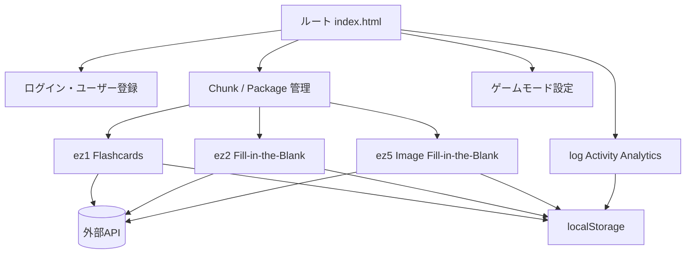
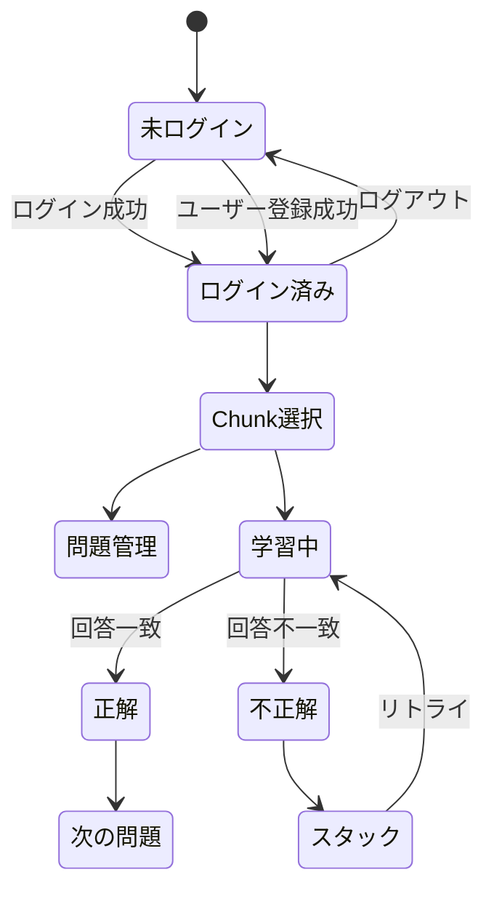

# ez 仕様書

最終確認日: 2026-07-31  
対象ディレクトリ: `/ez/`

## 1. 文書の目的と仕様の基準

本書は、`/ez/` 配下にあるブラウザアプリケーション群、共通機能、外部API連携、学習履歴、分析画面の実装仕様をまとめるものである。

仕様の基準はリポジトリ内のHTML、JavaScript、CSSであり、APIサーバー側の実装は含まれない。サーバー側でのみ決定されるデータベース構造、認証規則、厳密なバリデーションは「API依存」として扱う。

このリポジトリには開発途中の画面、旧版、検証ページが混在している。そのため、サービスの状態を次のように区分する。

| 区分 | 対象 | 扱い |
|---|---|---|
| アクティブ | `ez1`, `ez2`, `ez5` | 現行の利用対象。機能仕様・画面仕様・回帰テストの主対象 |
| ノンアクティブ | `ez3`, `ez3_old`, `ez4`, `ez6` | 現行の利用対象外。過去版、試作、実験・検証用として記録 |

`game`、`log`、ルート共通ファイルは、アクティブサービスから参照される可能性があるため、共通基盤として仕様の対象に含める。

## 2. システム概要

### 2.1 構成

本システムは、ビルド工程を前提としない静的なHTML/CSS/JavaScriptアプリケーションである。ルートの`index.html`がサービス選択、認証、パッケージ管理、ゲーム設定を提供し、各サービスの`index.html`が個別の学習機能を提供する。



### 2.2 技術構成

- HTML、Vanilla JavaScript、Vanilla CSS
- API通信はブラウザの`fetch`
- 永続化は外部APIとブラウザの`localStorage`
- `ez6`ではローカル同梱のKuromoji.jsと日本語辞書を使用
- `log`では同梱のChart.jsを使用
- `ez5`ではCanvas、Pointer/Mouse/Touchイベント、画像Blob/Data URLを使用

### 2.3 外部API

通常の接続先は`env.js`で定義される次のURLである。

```text
https://ez-server-d7h7.onrender.com
```

`env.js`にはローカル開発用として`http://localhost:3000`もコメントで記載されている。APIの応答はサービスごとに`item`、`data`、配列本体など複数形式を許容する実装になっている。

## 3. ディレクトリとファイル責務

| パス | 責務 | 状態 |
|---|---|---|
| `index.html` | ルート画面、認証、タブ、ゲーム設定、Package画面 | 共通基盤 |
| `env.js` | API URL、認証情報参照、活動ログ記録 | 共通基盤 |
| `chunk-widget.js` | Chunk選択・作成・所有者フィルター | 共通基盤 |
| `packaging.js` | Packageの取得、編集、削除、共有 | 共通基盤 |
| `game/loader.js` | ゲームモードの動的ロード、正解時エフェクト | 共通基盤 |
| `game/config.js` | ゲーム関連設定 | 共通基盤 |
| `game/style.css`, `game.css` | ゲーム表示スタイル | 共通基盤 |
| `ez1/` | フラッシュカード | アクティブ |
| `ez2/` | 穴埋め学習、音声学習 | アクティブ |
| `ez3/` | Reading Quiz、API検証 | ノンアクティブ |
| `ez3_old/` | `ez3`の旧版候補 | ノンアクティブ |
| `ez4/` | 音声書き取り | ノンアクティブ |
| `ez5/` | 画像穴埋め | アクティブ |
| `ez6/` | TTS単語クイズ、Kuromoji検証 | ノンアクティブ |
| `log/` | 活動ログ・グラフ表示 | 共通基盤 |

`app_old.js`などの旧ファイルは現行ページの主要なscript参照ではなく、履歴・比較用として扱う。

## 4. 共通仕様

### 4.1 認証

ルート画面では次の操作を提供する。

- ユーザーIDとパスワードによるログイン
- APIが発行する認証情報を利用したユーザー登録
- ログアウト
- IDとパスワードのクリップボードコピー

ログインは`POST /login`、登録は`POST /add_user`を使用する。個別サービスの作成・更新・削除リクエストでは、`user_id`と`password`をHTTPヘッダーに設定する。

認証情報は`localStorage`の`user_id`、`password`に保存され、ページ再読み込み時に自動入力・参照される。これは現在の実装上の仕様であり、安全な認証トークン管理ではない。

### 4.2 Chunk

Chunkは学習問題をまとめる単位で、`service_type`によって対象サービスを識別する。共通ウィジェットは次を行う。

- `GET /api/chunks?limit=100`で一覧取得
- サービス種別でフィルター
- 所有者のみ表示するフィルター
- `POST /chunks`で名前と`service_type`を指定して作成
- `chunk_id` URLパラメータによる初期選択
- 選択したChunkを個別サービスの再生画面へリンク

各サービスが使用する問題リソースとChunkの関係はAPI側の仕様に依存するが、`ez1`、`ez2`、`ez5`ではChunkを中心に一覧・作成・学習対象を切り替える。

### 4.3 Package

ルートのPackage画面は複数のChunkを順序付きでまとめる機能である。

- `GET /api/chunks?limit=1000`
- `GET /api/packages`
- `GET /api/packages/:id`
- 新規作成は`POST /api/packages`
- 更新は`PUT /api/packages/:id`
- 削除は`DELETE /api/packages/:id`
- `pack_id` URLパラメータで対象Packageを開く
- Packageに含まれるChunkをクリックで削除
- Package共有時は`pack_id`を含むURLをクリップボードへコピー
- 所有者判定により編集・削除可否を切り替える

Package内の要素にはChunk ID、サービス種別、並び順が含まれる。サービス種別から`ez1`、`ez2`、`ez5`などの再生先ディレクトリを解決する。

### 4.4 URLパラメータとページ間連携

- `chunk_id`: 個別サービスで使用するChunkを指定
- `pack_id`: Package画面で開くPackageを指定
- `localStorage`の一時ペイロード: `ez1`や`ez2`から別サービスへ文章・単語を引き渡す

ページ間ペイロードは読込後に削除する実装を持つため、再利用可能な永続データではない。

## 5. アクティブサービス仕様

### 5.1 EZ1: Flashcards（アクティブ）

画面タイトルは`Premium Flashcards`。単語・表裏テキストをカードとして学習する。

### 管理

- Chunkの選択・作成
- 問題一覧の取得
- カードの作成、更新、削除
- 複数問題のテキスト一括インポート・一括更新
- Chunkのクローン
- 複数Chunkのマージ
- APIテスト用の取得・削除操作

### 学習

- カードの表裏反転
- 次・前のカードへの移動
- シャッフル
- 自動再生モード
- 問題文と解答文の表示順切り替え
- 入力回答の判定
- 選択式クイズと結果表示
- 正解・不正解問題をスタックへ追加
- スタックの表示、削除、全消去、クリップボードコピー

### APIの基本形

リソース名は画面の設定に依存する。一般形は以下である。

```text
GET    /{resource}
GET    /{resource}/user/{user_id}
GET    /{resource}?chunk_id={chunk_id}
POST   /{resource}
PUT    /{resource}/{id}
DELETE /{resource}/{id}
```

作成・更新・削除ではJSON本文と`user_id`、`password`ヘッダーを送信する。

### 5.2 EZ2: Fill-in-the-Blank（アクティブ）

画面タイトルは`Fill-in-the-Blank Learning App`、画面上の名称は`Knowledge Builder`。単語または文中の空欄を入力して学習する。

### 管理

- 問題一覧の取得
- 問題の追加、編集、削除
- Chunk・所有者による表示切り替え
- 問題の正解語・空欄情報の管理

### 学習

- 空欄へのテキスト入力
- 複数空欄の回答
- 回答送信と正誤表示
- 正解語の表示・回答リビール
- 音声学習モード
- 音声選択肢の再生
- 問題をスタックへ追加
- スタックの表示、削除、全消去、コピー

### 連携

EZ1から文章を受け取り、EZ2の入力に反映するページ間連携を持つ。EZ2からEZ1へ単語をコピーする操作も実装されている。引き渡しデータは一時的な`localStorage`ペイロードである。

### 5.3 EZ5: Image Fill-in-the-Blank（アクティブ）

画面タイトルは`Image Fill-in-the-Blank`。画像上の文字列をマスクし、画像を見て元の文字列を回答する。

### 作成・管理

- 元画像の選択または一括インポート
- Canvas上でのマスク描画
- ブラシサイズ変更
- Undo / Redo
- 画像とマスク、正解文字列、補助内容の保存
- 一時保存レコードの一覧表示
- 一時保存からサーバーへのアップロード
- DB保存レコードの編集、更新、削除
- 複数レコード選択削除
- 自分のデータのみ表示する切り替え

### 学習

- 保存済み画像の一覧表示
- 元画像とマスク画像のロード
- マスク領域のクリック操作
- マスクの全表示・全非表示
- 回答文字列の保存
- EZ2への内容コピー
- 前後画像への移動
- 画像の先読み
- ズーム、カメラ移動、タッチジョイスティック

### API

実装で確認できる主なリソースは以下である。

```text
GET    /fill_image
GET    /fill_image/user/{user_id}
POST   /fill_image
PUT    /fill_image/{id}
DELETE /fill_image/{id}
POST   /upload-originals
POST   /fill_in_the_blank
POST   /fill_image/{id}  （操作内容により使用）
```

画像はURL、Blob、Data URLなど複数の表現を扱う。画像の具体的な保存先、容量制限、マスク形式はAPIおよびブラウザ実装に依存する。

## 6. ノンアクティブサービス仕様

以下はリポジトリに残る実装として記録するが、現行の利用対象ではない。

### 6.1 EZ3: Reading Quiz（ノンアクティブ）

- 文章（Passage）の作成・削除
- 設問と選択肢の作成・編集・削除
- 正解選択肢の設定
- 問題セットの保存
- 文章を選択してクイズ実行
- 全文正解判定
- `reading_quizzes`を対象とするAPIテストUI

`ez3_old`は旧版候補として扱い、`ez3`との実装差分を必要に応じて付録に記載する。

### 6.2 EZ4: Dictation Master（ノンアクティブ）

- 音声書き取り用リストの取得・作成・更新・削除
- ユーザー単位のリスト取得
- 音声再生
- キーボード入力による書き取り
- 文字単位のフィードバック
- 問題進行と完了画面

現行アクティブサービスとは別の学習体験であり、現在の主要回帰テスト対象には含めない。

### 6.3 EZ6: TTS Word Quiz（ノンアクティブ）

- 文章・単語データの取得、追加、削除
- 日本語文の単語分割
- Kuromoji.jsによる形態素解析
- 品詞フィルター
- Web Speech APIによる読み上げ
- 読み上げ速度と言語UIの切り替え
- 4択形式の単語クイズ
- 不正解文のスタック保存

`ez6/dict/`の辞書ファイルと`ez6/lib/kuromoji@0.1.2.js`に依存する。`jp3.html`〜`jp7.html`および`japanese_tokenizer_test*.html`は、形態素解析の実験・検証ページである。

## 7. ゲームモード

ルート画面からゲームモードを有効化できる。状態は`localStorage`の`game_mode`に`on`または`off`として保存される。

設定は`game_mode_config`にJSONで保存され、実装上は次の種類の設定を持つ。

- 正解時エフェクトの有効・無効
- 最大値到達時の挙動
- タップステップ

有効化時には`game/loader.js`を動的に読み込み、正解イベント`ez-correct-answer`を監視してエフェクトを表示する。初期状態は`off`である。

## 8. 活動ログと分析

### 8.1 記録

`env.js`がルートのログ画面を除くページで活動ログを記録する。主な記録対象は次のとおり。

- インタラクティブ要素のタップ数
- モードごとの滞在時間
- サービス別集計
- 日付別集計
- 画面の可視状態変更時の滞在時間確定
- ページ離脱時の滞在時間確定

保存先は`localStorage`の`ez_activity_logs`である。既存データをJSONとして読み込み、破損時は初期化する。

### 8.2 表示

`log/index.html`では次を表示する。

- EZ1、EZ2、EZ5のプロジェクト横断比較
- 滞在時間比較
- タップ数比較
- 直近7日間の日次推移
- サービス別総滞在時間
- サービス別総タップ数
- 最も活発なモード
- 詳細ログ
- ログのリセット

グラフ描画には同梱のChart.jsを使用する。

## 9. データ保存

### 9.1 localStorage

| キー | 用途 |
|---|---|
| `user_id` | ログインユーザーID |
| `password` | ログインパスワード |
| `ez_activity_logs` | 活動ログ集計 |
| `game_mode` | ゲームモードの有効状態 |
| `game_mode_config` | ゲームモード設定 |
| `ez6_stack` | EZ6の不正解スタック |
| ページ間連携用キー | EZ1・EZ2間の一時テキスト連携 |

サービスごとの一時保存やUI状態については、実装変更時にこの一覧を更新する。

### 9.2 外部APIデータ

API側に存在すると想定される概念は次のとおりである。

- User
- Chunk
- Package
- Flashcard / EZ1問題
- Fill-in-the-Blank / EZ2問題
- Image Fill-in-the-Blank / EZ5レコード
- Reading Quiz / EZ3問題
- Dictation List / EZ4問題
- TTS Word / EZ6文章・単語

厳密な必須項目、ID型、作成日時、所有者フィールド、レスポンスラッパーはAPIサーバー側の仕様確認が必要である。

## 10. API一覧

| メソッド | パス | 用途 |
|---|---|---|
| `POST` | `/login` | ログイン |
| `POST` | `/add_user` | ユーザー登録 |
| `GET` | `/api/chunks` | Chunk一覧 |
| `POST` | `/chunks` | Chunk作成 |
| `GET` | `/{resource}` | リソース一覧 |
| `GET` | `/{resource}/user/{user_id}` | ユーザー所有データ一覧 |
| `GET` | `/{resource}/{id}` | 1件取得 |
| `POST` | `/{resource}` | 作成 |
| `PUT` | `/{resource}/{id}` | 更新 |
| `DELETE` | `/{resource}/{id}` | 削除 |
| `GET` | `/api/packages` | Package一覧 |
| `GET` | `/api/packages/{id}` | Package詳細 |
| `POST` | `/api/packages` | Package作成 |
| `PUT` | `/api/packages/{id}` | Package更新 |
| `DELETE` | `/api/packages/{id}` | Package削除 |
| `GET` | `/fill_image` | EZ5画像問題一覧 |
| `POST` | `/fill_image` | EZ5画像問題作成 |
| `PUT` | `/fill_image/{id}` | EZ5画像問題更新 |
| `DELETE` | `/fill_image/{id}` | EZ5画像問題削除 |
| `POST` | `/upload-originals` | EZ5元画像一括アップロード |
| `POST` | `/fill_in_the_blank` | EZ5からEZ2形式への登録 |

APIの多くは認証ヘッダーとして次を使用する。

```http
user_id: <user id>
password: <password>
Content-Type: application/json
```

## 11. 状態遷移とエラー処理



実装では、通信失敗・空データ・認証情報不足・画像ロード失敗・辞書ロード失敗などに対して、画面メッセージ、空状態、Toast、またはコンソールエラーを表示する。API共通のエラーコードやリトライポリシーは定義されていない。

## 12. セキュリティとプライバシー上の注意

現在の実装には次の注意点がある。

- パスワードを`localStorage`へ平文保存する。
- API呼び出しに認証情報をHTTPヘッダーで直接送信する。
- API応答やユーザー入力をHTMLへ挿入する箇所があるため、XSS対策を継続確認する必要がある。
- 外部API、Google Fonts、Web Speech API、外部画像URLに依存する。
- `localStorage`のデータは同一ブラウザプロファイル内の他スクリプトから参照可能である。
- CORS、レート制限、サーバー側認可、ファイルサイズ制限は本リポジトリから確認できない。

本番運用時には、パスワードの保存を避け、短期トークン等のサーバー主導の認証方式へ移行することが望ましい。

## 13. 対応ブラウザ・実行前提

- JavaScriptを実行できるブラウザ
- `fetch`、`localStorage`、Clipboard API
- EZ5ではCanvas、画像Blob、Touch/Mouseイベント
- EZ6ではWeb Speech API、Kuromoji辞書の読み込み
- HTTPS環境では、API接続先もHTTPSであること
- 静的ファイルをHTTPサーバー経由で配信することを推奨

ファイルを直接`file://`で開いた場合、相対パス、fetch、辞書、CORSの制約により一部機能が動作しない可能性がある。

## 14. テスト方針

### 14.1 アクティブ機能の必須確認

- ルート画面の表示、タブ切り替え
- ログイン、登録、ログアウト、認証情報の再読込
- Chunk一覧、Chunk作成、サービス別フィルター
- EZ1のカードCRUD、学習、クイズ、スタック、一括編集
- EZ2の問題CRUD、穴埋め、音声学習、スタック
- EZ5の画像登録、マスク描画、Undo/Redo、学習、更新、削除
- Packageの作成、編集、削除、共有URL
- 活動ログのタップ数・滞在時間・日次集計
- API失敗、空データ、未ログイン時の表示

### 14.2 ノンアクティブ機能の確認

ノンアクティブサービスは、変更時の影響確認および参照仕様の確認を目的に、ページが壊れていないこと、主要な外部依存が明示されていることを確認する。現行リリースの機能受入れ基準には含めない。

## 15. 学習UIの詳細仕様

この章は、学習者が画面を開いてから問題を解き、次の問題へ進むまでの表示と操作を記述する。管理画面のCRUDよりも、学習中に何が表示され、どの操作で状態が変わるかを優先する。

### 15.1 EZ1 Flashcards：学習モード

初期タブは「学習モード」である。問題集を選択すると、選択したChunkのカードが学習デッキに入り、カードがない場合は「カードがありません」と作成タブへの案内だけを表示する。

表示要素は次のとおり。

- 進捗バー
- 現在位置 / 総カード数
- 表面と裏面を持つフラッシュカード
- 「前へ」「シャッフル」「オート開始」「スタック」ボタン

カード操作の状態遷移は次のとおり。

1. 初期状態では問題面だけを表示し、回答面は隠す。
2. カード本体をクリックすると3D反転し、回答面を表示する。
3. 回答面が表示された状態でカード本体を再度クリックすると次のカードへ進む。
4. 「前へ」ボタンと、回答面でカード本体を再クリックする操作は、デッキの端で停止せず先頭・末尾を循環する。
5. 問題が切り替わるとカードは自動的に問題面へ戻る。
6. 進捗は`(現在位置 + 1) / カード数`で計算し、カード切替時に更新する。
7. Q&A反転を有効にすると、通常の問題と回答の役割を入れ替える。

「シャッフル」は確認ダイアログを表示し、承認後に現在のデッキ順をランダム化して先頭から再開する。「オート開始」は0.5、1、3、5秒のいずれかを入力させ、指定間隔で問題面表示と回答面表示を交互に行う。オート中はボタンが「オート停止」に変わり、停止するとタイマーを破棄する。

「スタック」は現在表示中のカードを復習対象に追加する。右下のスタックボタンから一覧を開き、個別削除、全消去、クリップボードへのコピーを行う。

### 15.2 EZ1 Flashcards：入力回答モード

「入力回答」タブではカードの問題面だけを表示し、回答入力欄に文字を入力する。

- 表示は現在カード、進捗バー、現在位置 / 総数、入力欄、フィードバック欄。
- Q&A反転が有効なら、表示される問題と入力すべき回答も反転する。
- 入力値が回答と完全一致した時点で即時に「正解！」を表示する。
- 正解後は入力欄を無効化し、約1秒後に次のカードへ移動する。
- 不正解時には自動遷移せず、利用者が入力を修正する。
- カード表示・シャッフル・スタック追加は通常の学習モードと同じデッキを使用する。

### 15.3 EZ1 Flashcards：3択問題モード

「3択問題」タブへ切り替えると、現在のデッキを登録順でクイズ用デッキとして初期化し、スコアを0に戻して開始する。

- 問題文、進捗、現在スコア、3つの選択肢を表示する。
- 正解1つと、同じデッキ内から選ばれた不正解候補最大2つを表示する。
- 選択肢の順序は毎回ランダム化する。
- 回答後は全選択肢を無効化する。
- 正解選択肢は成功色、誤って選んだ選択肢はエラー色で表示する。
- 回答後に「次の問題」ボタンを表示する。
- 全問終了後は正解数、総数、正答率を表示し、再スタート操作を提供する。
- 空のデッキではクイズ画面ではなく、カード作成を促す空状態を表示する。

### 15.4 EZ2 Fill-in-the-Blank：通常学習

EZ2は初期状態では問題作成タブを表示する。「Learning Mode」へ切り替えると、問題選択セレクトボックスと1問分の学習本文を表示する。セレクトボックスの各項目は問題文の先頭約10文字をタイトルとして生成する。

問題データは、全文の`question`と、隠す語のリストを含む`answer`から構成される。`answer`内の複数リストは`|||`で分離され、複数リストがある場合は本文下に`List 1`、`List 2`のタブを表示する。

問題表示時の処理は次のとおり。

1. 選択したリストから改行区切りの対象語を取得する。
2. 本文中に実際に含まれる対象語だけを穴埋め対象とする。
3. 対象語の出現箇所をセレクトボックスに置き換える。
4. 各セレクトボックスには正解と、同じ本文に存在する別対象語から最大2つのダミーを入れる。
5. 初期値は`___`で、利用者が選択して回答する。

正解時は、セレクトボックスを正解語のテキストへ置換し、正解イベントを発火する。同じ正解語が本文中に複数回ある場合、「Once OK」が有効なら、1箇所の正解を受けて同じ正解語の穴を自動入力する。「Once OK」は手動回答時だけ適用し、自動入力の再帰では再適用しない。

不正解時は選択欄にエラーアニメーションを付け、約0.5秒後に未選択状態へ戻す。次の問題には進まず、その場で再回答する。「間違えたら自動でスタックに追加」が有効なら、正解語を重複排除してスタックに追加する。

### 15.5 EZ2 Fill-in-the-Blank：音声学習

「Audio Learning」タブでは、問題を選択し、言語、読み上げ速度、待機秒数、待機条件文字数、ミス時の読み上げスキップを設定して「Play」を押す。

- 言語は日本語または英語。
- 速度は0.5〜2.0倍。
- 短いテキストの回答待機時間は指定秒数。
- 文章が長い場合は、現在の読み上げ終了を回答待機の基準にする。
- 再生中は「Play」が隠れ、「Stop」が表示される。
- 本文は読み上げ済み、現在の読み上げ箇所、未到達箇所を視覚的に区別する。
- 現在の対象語は`[___]`として表示し、3択ボタンを表示する。

選択肢は対象語1つと別対象語最大2つで構成される。正解時はボタンを正解色にし、空欄を正解語へ置換して正解語を読み上げ、約300ms後に次のステップへ進む。不正解時は選択したボタンをエラー色、正解ボタンを正解色にしてスタックへ追加する。「ミス時に読み上げスキップ」が有効なら、現在の音声を停止して回答を表示する。無効なら音声終了後に回答を表示する。待機時間切れも不正解相当として処理し、正解を表示して次へ進む。

対象語が3つ未満、または本文中に適用できる対象語が3つ未満の場合は、再生を開始せずエラーメッセージを表示する。

### 15.6 EZ5 Image Fill-in-the-Blank：学習画面

「Play」タブにはサーバー保存済みの画像問題をカード形式で縦に表示する。表示フィルターは「黒塗り有りのみ」「黒塗り無しのみ」「両方」で、初期値は「両方」である。

各カードの初期状態では画像を一括ロードせず、ファイル名、問題番号、黒塗り未編集の警告、そして「画像を読み込む」ボタンだけを表示する。ボタン押下後に元画像とマスク画像を読み込み、キャンバス上に合成表示する。

ロード後に利用者ができる操作は次のとおり。

- 画像上の黒塗り領域をタップして、その連結領域だけを表示・非表示に切り替える。
- 「全て非表示」を押して全マスク領域を隠す。
- 全て非表示の状態ではボタンが「全て表示」に変わる。
- 「前へ」「次へ」で保存済みリスト内の前後画像へ移動する。
- 表示中のカードから「編集へ」で作成タブの編集対象を開く。
- Target（隠す語）とContent（元文）を編集し、「テキスト保存」でサーバーのレコードを更新する。
- TargetとContentを入力した状態で「ez2へ保存」を押すと、EZ2用問題として登録する。

マスク画像の白または透明部分はマスクなしとして扱い、黒い部分は不透明な黒として補正してから表示する。画像のクリック位置は表示サイズから元画像座標へ変換して判定するため、縮小表示でも対応する領域を切り替える。

### 15.7 EZ5 Image Fill-in-the-Blank：作成・編集UI

「Create」タブでは画像を複数選択できる。複数選択した画像はマスクなしの一時レコードとして登録され、後から編集してマスクを追加する。

編集対象を開くとCanvasとツールバーが表示される。

- ブラシ／消しゴムの切り替え
- ブラシサイズ変更
- Undo / Redo
- 一時リストへの保存
- 前後レコードへの移動
- Play画面での表示
- Target文字列とContent文字列の編集

「保存されたペア」はブラウザメモリ上の一時データであり、ページをリロードすると消える。「サーバーに保存済みのペア」はDBデータであり、編集ボタンでCanvasへロードして上書き保存する。DB一覧では全選択・全解除と選択削除を利用できる。

### 15.8 ノンアクティブサービスの学習UI

#### EZ3 Reading Quiz

問題セットを選択して「Execute」を開始する。文章と設問を表示し、各設問の選択肢を選んで正誤を確認する。全設問の回答後に結果を表示する。現行アクティブサービスではないため、UIの細かな文言・採点仕様は参考実装として扱う。

#### EZ4 Dictation Master

学習リストを選択して開始し、音声を再生しながら入力欄に書き取る。入力文字は文字単位でフィードバックされ、キーボードイベントを利用して進行する。全問題終了時には完了画面を表示する。リスト選択、問題管理、学習、完了の4状態を持つ。

#### EZ6 TTS Word Quiz

文章リストから問題を選び、文を単語へ分割して読み上げる。品詞フィルターで出題対象を絞り、現在の単語に対する選択肢を表示する。不正解文は`ez6_stack`へ保存し、スタックから再挑戦できる。読み上げ、一時停止、再開、停止、速度変更、4択回答が学習UIの主要操作である。Kuromoji辞書のロード中は準備状態、失敗時はエラー状態を表示する。

## 16. 画面別・機能別の詳細仕様

### 16.1 ルート画面

ルート画面は`index.html`で提供し、サービスへの入口、認証、Package管理、ゲーム設定を同一画面のタブで提供する。画面内のタブは次の5種類である。

| タブ | 主な内容 |
|---|---|
| Packages | ChunkとPackageの閲覧・編集 |
| Services | サービスへの入口と利用状態の表示 |
| Analytics | 活動ログ画面への導線 |
| Settings | 認証情報とゲームモード設定 |
| Development | 開発・検証向け表示 |

タブ切り替え時は、全タブの`active`クラスを除去した後、選択したタブと対応するコンテンツだけに`active`を付与する。初期表示タブはHTMLのクラス指定に従う。

### 16.2 ルート画面：ログイン・登録UI

認証欄にはユーザーID入力、パスワード入力、ログイン、ユーザー登録、ログアウト、資格情報コピーの操作がある。

#### 初期表示

1. `localStorage.user_id`と`localStorage.password`を読み込む。
2. 値が存在する場合は入力欄へ反映する。
3. ログイン済みかどうかはサーバーセッションではなく、ブラウザに保存された値の有無を基準に画面表示する。
4. 個別サービスでは認証情報がない場合、ログイン必要メッセージを表示し、作成・更新・削除系操作を開始しない。

#### ログイン

1. 入力値を前後空白除去して取得する。
2. IDまたはパスワードが空なら通信せず、入力エラーを表示する。
3. `POST /login`へJSONを送信する。
4. 応答JSONを解析し、成功時は`user_id`と`password`を保存する。
5. 成功メッセージを表示し、PackageやChunkの一覧を再読み込みする。
6. HTTPエラーまたはJSON解析エラー時は認証失敗メッセージを表示する。

#### ユーザー登録

1. `POST /add_user`を呼び出す。
2. API応答から`user_id`と`password`を、ラッパーがある場合は`data`内から抽出する。
3. 発行された資格情報をlocalStorageと入力欄に反映する。
4. 登録結果を利用者へ表示する。

#### ログアウト

`user_id`と`password`をlocalStorageから削除し、入力欄を空にする。ログアウト後はユーザー所有データの表示を再評価し、編集・削除ボタンを利用できない状態にする。

### 16.3 ルート画面：Chunk一覧UI

Chunkはサービス種別付きの問題集として表示する。画面には一覧、所有者フィルター、再生リンク、作成操作がある。

- 初回表示時にChunk一覧を取得する。
- 一覧取得は最大件数をクエリで指定する。
- 「全員」「自分のデータ」の表示切り替えを提供する。
- サービス種別は表示用ディレクトリ名へ変換する。
- 再生リンクは`index.html?chunk_id=<id>`形式で生成する。
- 新規Chunk作成時は名前入力ダイアログを表示する。
- 名前が空の場合は作成リクエストを送信しない。
- 作成成功後は一覧を再取得し、新しいChunkを選択可能にする。
- API失敗時は一覧を消去せず、エラーを表示する。

### 16.4 Package編集UIの詳細

Package編集画面は、左側または上部に利用可能なChunk、中央にPackage名と選択中のChunk、操作領域に保存・削除・共有を表示する。

#### Package選択

- Package一覧取得後、セレクトボックスへ名前とIDを設定する。
- `pack_id`がURLにある場合は、そのPackageを自動選択する。
- 選択変更時に`GET /api/packages/:id`を呼び、詳細を編集状態へ反映する。
- 詳細取得に失敗した場合は、既存の編集内容を不用意に上書きせずエラー表示する。

#### Chunk追加・削除

- 利用可能Chunkから対象を選択し、Packageへ追加する。
- Package内のChunkは配列順を保持する。
- Package内のChunkをクリックすると、その要素を削除候補として扱う。
- サービス種別はChunk自身の値を優先し、欠落時は関連Chunkの値、最後に`flashcards`をフォールバックにする。

#### 保存

1. ログイン状態を確認する。
2. Package名を前後空白除去する。
3. 名前が空、またはChunkがない場合の扱いは画面メッセージとAPI仕様に依存する。
4. 各Chunkについて`chunk_id`、`service_type`、順序情報を含む配列を生成する。
5. IDがある場合は`PUT /api/packages/:id`、ない場合は`POST /api/packages`を呼び出す。
6. 成功後にPackage一覧を再取得し、現在のPackage情報を更新する。

#### 削除・共有

- 削除は対象Package IDを確認して`DELETE /api/packages/:id`を呼ぶ。
- 共有は現在URLへ`pack_id`を付加したURLを生成し、Clipboard APIへ渡す。
- Clipboard利用不可時のフォールバックは実装依存であり、URL自体を画面へ表示する仕様は未定義である。

### 16.5 共通Chunkウィジェット

`chunk-widget.js`は`data-resource-type`属性でサービス種別を受け取り、各サービスページへ同じ操作UIを埋め込む。

1. 対象コンテナが存在しないページでは何もしない。
2. `GET /api/chunks?limit=100`を実行する。
3. `resourceType`が指定されている場合は`service_type`をクエリへ追加する。
4. 応答を配列化し、サービス種別が一致するデータを表示する。
5. URLの`chunk_id`が存在する場合は、そのChunkを初期選択する。
6. セレクト変更時にカスタムイベントまたは画面側のコールバックで学習データを再取得する。
7. 所有者フィルター変更時は一覧表示を再描画する。

### 16.6 EZ1：問題作成・一括編集UI

EZ1の「問題作成」タブには、問題と解答を`問題=解答`形式で1行ずつ入力するテキストエリアがある。

- 初期表示時は現在のカードを`question=answer`形式へ変換して入力欄に表示する。
- 保存時は改行で分割する。
- 各行を`=`で分割し、左側を問題、右側以降を解答として扱う。
- `=`を解答内に含む場合、2個目以降の`=`を解答側に残す。
- 空行は無視する。
- 問題または解答が空の行は登録対象にしない。
- 有効なカードが0件で、入力欄に文字が残っている場合は空データ化の確認を表示する。
- 保存成功後は一覧、学習デッキ、入力回答画面、クイズを更新する。

Q&A反転チェックボックスは、問題データそのものを書き換えず、学習時の表示方向だけを変更する。左側コピー・右側コピーは一方の列を抽出し、EZ2へ移動する操作では一時ペイロードを保存してから遷移する。

### 16.7 EZ2：問題作成UI

EZ2の問題作成画面は、全文、隠す語のリスト、問題追加ボタン、問題一覧で構成される。

- 全文は複数行テキストとして入力できる。
- 隠す語は1行1語で入力する。
- 「リストを追加」で同一全文に対する別の正解語リストを追加する。
- 各リストには削除ボタンがあるが、最低1リストは残す。
- 保存時は複数リストを`|||`で連結する。
- 問題一覧にはユーザーフィルターを表示し、全員、自分、自分以外を切り替える。
- 既存問題の編集は問題データを入力欄へ戻し、保存時に更新する。
- 削除時は対象問題をAPIから削除し、一覧と学習セレクタを更新する。

「すべてのリストをスタックに追加」は、各リストの語を問題としたスタック項目を作成する。EZ1へのコピーでは、全文または隠す語を指定した形式にして一時ペイロードへ保存する。

### 16.8 EZ5：画像作成・保存UIの詳細

#### 画像取込み

- `image/*`の複数ファイルを選択できる。
- 選択した画像は順番を保持して一時レコード化する。
- 元画像はCanvas表示に合わせて読み込む。
- 元画像の読み込みに失敗した場合は対象レコードを保存せず、Toastまたは画面メッセージを表示する。

#### Canvas編集

- ブラシモードではポインタ移動に沿って黒マスクを描画する。
- 消しゴムモードではマスクを透明化する。
- ブラシサイズはスライダーの値を次の描画から適用する。
- 描画前後のCanvas状態を履歴へ積み、UndoとRedoで移動する。
- 新しい描画を行った場合、現在位置より後ろのRedo履歴を破棄する。
- タッチ入力ではスクロールを抑制し、画像上の描画を優先する。

#### 一時保存とサーバー保存

- 「Save to List」はブラウザメモリ内の一時リストへ追加または現在レコードを更新する。
- 一時リストはページリロード時に失われる。
- サーバー保存時は画像、マスク、Target、ContentをFormDataまたはAPI仕様に応じた形式で送信する。
- 保存中はボタンを無効化し、スピナーを表示する。
- 成功時は保存済み一覧を再描画し、失敗時は編集内容を画面に残す。

### 16.9 EZ5：Play画面の表示状態

各画像カードは次の表示状態を持つ。

```text
未ロード → ロード中 → 表示中
                    └→ ロード失敗
表示中 → 前後移動
表示中 → 編集画面へ移動
表示中 → テキスト更新
```

ロード中は読み込みボタンを無効化し、スピナーと「画像ロード中」を表示する。表示中は元画像、マスクCanvas、全表示切り替え、前後移動、Target/Content編集を表示する。

## 17. データ構造の詳細（実装から推定できる範囲）

### 17.1 認証情報

```json
{
  "user_id": "ユーザー識別子",
  "password": "パスワード"
}
```

この値はログインAPIのリクエスト、各CRUD APIの認証ヘッダー、localStorageに利用される。実際のパスワード要件とサーバー側のハッシュ化はAPI依存である。

### 17.2 Chunk

```json
{
  "id": "Chunk ID",
  "name": "問題集名",
  "service_type": "flashcards",
  "user_id": "所有者ID"
}
```

`id`、`user_id`の型、所有者フィールド名、作成日時の有無はAPI応答に依存する。フロントエンドはIDを文字列化して比較する箇所があるため、数値・文字列のどちらの応答も許容する。

### 17.3 EZ1カード

```json
{
  "question": "問題面",
  "answer": "回答面",
  "chunk_id": "所属Chunk ID"
}
```

画面内ではAPIレコードの識別子を保持するが、学習デッキは問題と回答を持つカード配列として扱う。

### 17.4 EZ2問題

```json
{
  "question": "全文",
  "answer": "apple\nbanana|||red\nblue",
  "chunk_id": "所属Chunk ID"
}
```

`answer`は`|||`で候補リスト、各リスト内は改行で対象語を分離する。UIでは対象語が本文に存在する場合だけ穴へ変換する。

### 17.5 EZ5レコード

```json
{
  "id": 1,
  "original": "元画像URL",
  "mask": "マスク画像URL",
  "target": "隠す文字列",
  "content": "元文",
  "user_id": "所有者ID",
  "chunk_id": "所属Chunk ID"
}
```

画像URLの実体、マスク画像のフォーマット、空マスクの表現はAPI依存である。フロントエンドは白または透明ピクセルをマスクなしとして扱う。

### 17.6 Stack

スタックはサービスごとに画面内配列として管理する。代表的な項目は次の形である。

```json
{
  "question": "復習対象",
  "answer": "補助回答"
}
```

同一`question`の重複を避ける実装がある。EZ6のスタックは`ez6_stack`へJSON保存されるが、EZ1・EZ2のスタック保存範囲はページ実装に依存する。

## 18. 通信、ローディング、エラー表示の詳細

### 18.1 通信開始時

- 保存・削除ボタンを一時的に無効化する。
- ボタン文言を「保存中」「削除中」などへ変更する箇所がある。
- 画像ロードでは対象カード内だけをローディング状態にする。
- 一覧再取得中も既存UIを可能な限り維持する。

### 18.2 成功時

- API応答をJSON化する。
- `item`、`data`、配列本体のいずれかからデータを取り出す。
- ローカル配列を更新するか、一覧を再取得する。
- 成功Toast、成功メッセージ、または画面更新を行う。

### 18.3 失敗時

- `response.ok`が偽の場合はエラーとして扱う。
- ネットワーク例外、JSON解析例外、画像読込例外を画面またはコンソールへ出力する。
- 未ログイン操作はAPI通信前に止める。
- 空配列の場合は、一覧では空状態、学習画面では作成案内を表示する。
- 失敗後も入力中のデータをできるだけ保持し、再試行可能な状態に戻す。

共通のエラーコード、表示文言、再試行回数、指数バックオフは実装上統一されていない。サービス間で共通化する場合は別途仕様を定義する。

## 19. 活動ログの記録単位詳細

### 19.1 モード判定

`env.js`は、アクティブなタブ、ビュー、URLパス、サービスディレクトリを組み合わせて現在モードとサービスを推定する。対象パスが`/ez1/`、`/ez2/`、`/ez5/`などの場合はサービス識別子を抽出する。

### 19.2 タップ記録

ボタン、リンク、入力、セレクト、テキストエリア、カード、`role="button"`、タブボタンなどの操作をインタラクションとして数える。同一クリックイベントのバブリングによる重複を避ける必要がある。

### 19.3 滞在時間

モード開始時刻を保持し、次のタイミングで経過秒数を加算する。

- 別モードへの切り替え
- ページの`beforeunload`
- `visibilitychange`による非表示化

日次キーはブラウザの日付を基準とする。日付変更をまたぐ滞在時間の分割方法は実装上の確認事項である。

## 20. UI状態・操作性の共通ルール

- `active`クラスで表示中のタブやビューを判定する。
- 空データでは操作領域を隠し、作成画面への案内を表示する。
- 非同期操作中は二重送信を防ぐ。
- 操作結果はテキスト、色、Toast、ボタン状態のいずれかでフィードバックする。
- 画像や辞書など重いリソースは可能な限り遅延読み込みする。
- 画面遷移時にページ間連携用の一時データを読み込み、処理後に削除する。
- モバイル向けにタッチ操作、レスポンシブレイアウト、画像ズームを考慮する。

## 21. 未確定事項・今後の更新ルール

以下はサーバー仕様または追加調査が必要である。

- APIの正式なOpenAPI定義
- 認証方式とセッション有効期限
- 全リソースの正式なJSONスキーマ
- Chunkと各サービスリソースの正確な関連
- Packageの共有権限
- 画像の最大サイズ、形式、保存期間
- 音声データの取得元とライセンス
- `ez3`、`ez4`、`ez6`を再びアクティブ化する条件
- 文字化けしている既存プロジェクト文書の修正方針

仕様変更時は、次の順に更新する。

1. 対象サービスの状態（アクティブ／ノンアクティブ）を確認する。
2. 画面、イベント、API、保存データを実装と照合する。
3. API一覧・データ一覧・状態遷移を更新する。
4. 必須テストを実施する。
5. 本書の最終確認日と未確定事項を更新する。
